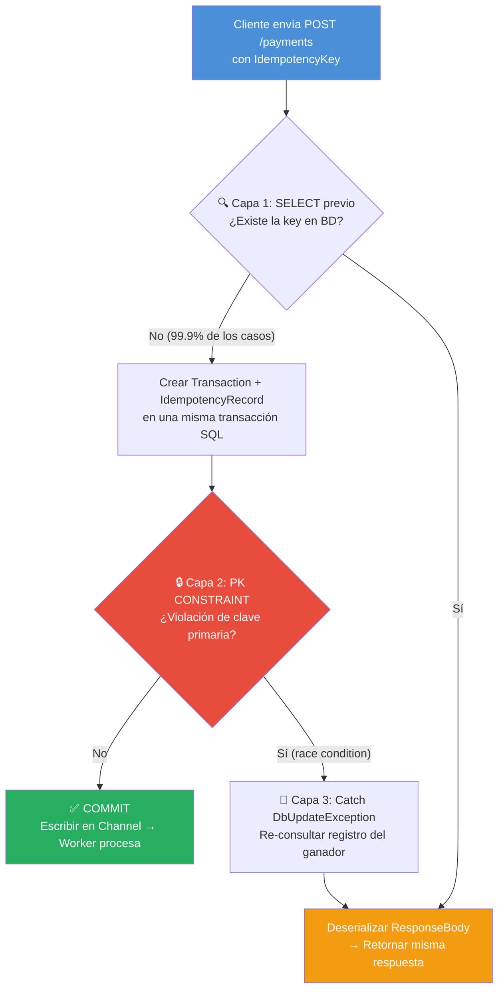
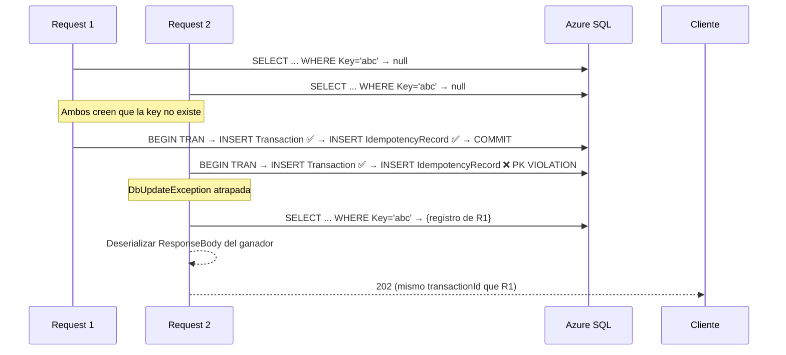

# 🔐 Idempotencia en Payment Processor

> Documento preparado para entrevista técnica — Explicación del mecanismo de idempotencia implementado en el procesador de pagos.

---

## ¿Qué es la idempotencia?

En APIs de pago, **idempotencia** significa que enviar la misma solicitud múltiples veces produce el mismo resultado que enviarla una sola vez. El cliente nunca es cobrado dos veces por el mismo pago.

### El problema que resuelve

```
Cliente → POST /payments (amount: 15000)
         ↩ 202 Accepted

⚠️ El cliente recibe timeout de red (no sabe si el pago se creó)
Cliente → POST /payments (amount: 15000) ← misma key
         ↩ 202 Accepted (mismo transactionId, sin duplicar el cobro)
```

**Sin idempotencia:** el merchant cobraría dos veces. **Con idempotencia:** el segundo request retorna el mismo resultado.

---

## Arquitectura: 3 capas de defensa



---

## Capa 1: SELECT previo (camino rápido)

**99.9% de los casos pasan por aquí.** Antes de insertar nada, verificamos si la key ya existe.

```csharp
// PaymentService.CreatePayment()
IdempotencyRecord? existing = await _repo.GetIdempotencyRecordAsync(request.IdempotencyKey);

if (existing != null)
{
    // Key ya existe → retornar respuesta original sin hacer nada nuevo
    return JsonSerializer.Deserialize<CreatePaymentResponse>(existing.ResponseBody)!;
}
```

La consulta SQL ignora registros con más de 24 horas:

```csharp
// PaymentRepository.GetIdempotencyRecordAsync()
_db.IdempotencyRecords
    .Where(i => i.Key == key && i.CreatedAt >= DateTime.UtcNow.AddHours(-24))
```

### ¿Por qué TTL de 24 horas?

- Las redes no tienen latencias de días; si un cliente no recibe respuesta, reintentará en segundos o minutos.
- Mantener registros para siempre genera ruido y consumo de almacenamiento innecesario.
- 24h es un margen seguro y conservador para entornos de pago.

---

## Capa 2: PRIMARY KEY como último guardián

El modelo `IdempotencyRecord` usa la key como **clave primaria**:

```csharp
// ApplicationDbContext.OnModelCreating()
modelBuilder.Entity<IdempotencyRecord>(entity =>
{
    entity.ToTable("IdempotencyRecords");
    entity.HasKey(i => i.Key);  // ← La BD rechaza duplicados a nivel de engine
});
```

Esto garantiza que **incluso si dos threads pasan la Capa 1 al mismo tiempo**, solo uno logrará insertar.

---

## Capa 3: Manejo de race condition

Cuando dos requests con la misma key llegan en el mismo milisegundo:



```csharp
// PaymentService.CreatePayment()
catch (DbUpdateException ex) 
    when (ex.InnerException?.Message.Contains("PK__Idempote") == true)
{
    _logger.LogWarning("Race condition detectada para key {Key}, recuperando registro existente",
        request.IdempotencyKey);

    existing = await _repo.GetIdempotencyRecordAsync(request.IdempotencyKey);
    return JsonSerializer.Deserialize<CreatePaymentResponse>(existing.ResponseBody)!;
}
```

### EF Core Execution Strategy

Además, envolvemos todo en la estrategia de ejecución de EF Core para reintentos a nivel BD:

```csharp
// PaymentRepository.CreateTransactionWithIdempotencyAsync()
IExecutionStrategy strategy = _db.Database.CreateExecutionStrategy();
return await strategy.ExecuteAsync(async () =>
{
    using IDbContextTransaction dbTransaction = await _db.Database.BeginTransactionAsync();
    // INSERT Transaction + INSERT IdempotencyRecord → COMMIT
});
```

---

## Estructura de la tabla IdempotencyRecords

| Columna | Tipo | Descripción |
|---------|------|-------------|
| **Key** | `nvarchar` (PK) | `IdempotencyKey` enviada por el cliente |
| **TransactionId** | `uniqueidentifier` | FK a la transacción creada |
| **ResponseBody** | `nvarchar` | JSON completo de la respuesta original |
| **CreatedAt** | `datetime2` | Timestamp para el TTL de 24h |

### ¿Por qué guardar el ResponseBody completo?

En lugar de solo guardar el `TransactionId`, guardamos el JSON completo de la respuesta. Esto permite:

- **Reconstrucción exacta:** El segundo request recibe exactamente el mismo JSON, byte por byte.
- **Sin queries adicionales:** No necesitamos hacer JOIN a `Transactions` para reconstruir la respuesta.
- **Inmutabilidad:** Aunque la transacción subyacente cambie de estado (PENDING → APPROVED), el segundo request recibe lo mismo que el primero.

---

## Resumen para la entrevista

| Pregunta esperada | Respuesta |
|---|---|
| **¿Cómo evitan cobros duplicados?** | Idempotencia con 3 capas: SELECT previo → PK constraint → catch de race condition |
| **¿Qué pasa si dos requests llegan al mismo tiempo?** | La BD rechaza el segundo INSERT por PK violation; el código lo captura y retorna la respuesta del ganador |
| **¿Por qué TTL de 24 horas?** | Margen seguro para reintentos de red; evita acumulación infinita de registros |
| **¿Qué pasa si la BD falla durante la inserción?** | EF Core Execution Strategy reintenta la transacción completa automáticamente |
| **¿El cliente nota algo diferente?** | No. Ambos requests reciben exactamente el mismo JSON (mismo `transactionId`, mismo `createdAt`) |
