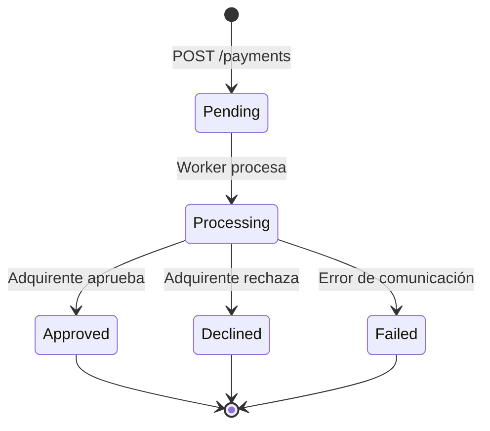

# Payment Processor API

API REST para procesamiento asíncrono de pagos construida con **.NET 8**, diseñada bajo principios **SOLID** y arquitectura orientada a **eventos**, con comunicación a un adquirente externo a través de **Polly** para resiliencia HTTP.

## Características

- ✅ **Procesamiento asíncrono** — Los pagos se encolan en un canal en memoria y se procesan en segundo plano.
- ✅ **Idempotencia** — Garantiza que una misma solicitud con el mismo `IdempotencyKey` no procese duplicados (ventana de 24h).
- ✅ **Resiliencia HTTP** — Políticas de **retry** (3 reintentos con exponential backoff) y **circuit breaker** (5 fallos, 30s de pausa) para la comunicación con el adquirente.
- ✅ **Event Sourcing** — Cada cambio de estado en una transacción se registra como un evento inmutable.
- ✅ **Logging estructurado** — Serilog con salida JSON para fácil integración con sistemas de monitoreo.
- ✅ **CQRS** — Separación de responsabilidades de lectura y escritura en capas de servicio y repositorio.
- ✅ **Documentación OpenAPI** — Swagger UI disponible en entorno de desarrollo.

## Stack Tecnológico

| Componente | Tecnología |
|---|---|
| **Runtime** | .NET 8 (ASP.NET Core) |
| **ORM** | Entity Framework Core 8 |
| **Base de datos** | Azure SQL Server |
| **Logging** | Serilog (formato JSON compacto) |
| **Resiliencia** | Polly (retry + circuit breaker) |
| **Cola en memoria** | `System.Threading.Channels` (Unbounded) |
| **Documentación** | Swashbuckle (Swagger / OpenAPI) |

## Arquitectura

La aplicación sigue un patrón de **procesamiento asíncrono basado en canales**:

1. El cliente HTTP envía una solicitud de pago a la API REST.
2. El controlador delega en `PaymentService`, que verifica idempotencia y persiste la transacción como `PENDING`.
3. El `TransactionId` se escribe en un canal en memoria (`System.Threading.Channels`).
4. Un `BackgroundService` (`PaymentWorkerService`) consume el canal e invoca la integración con el adquirente.
5. `AcquirerIntegrationService` actualiza el estado de la transacción (`PROCESSING` → `APPROVED` / `DECLINED` / `FAILED`) y registra eventos.
6. El cliente puede consultar el estado de la transacción mediante el endpoint `GET /payments/{id}`.

```mermaid
flowchart TB
    subgraph Client["Cliente HTTP"]
        A[POST /payments] --> B[GET /payments/{id}]
    end

    subgraph API["Payment Processor API"]
        direction TB
        C[PaymentController] --> D[PaymentRequestValidator]
        C --> E[IPaymentService]
        C --> F[IPaymentQueryService]
        
        E --> G{IdempotencyKey existe?}
        G -- Sí --> H[Retornar respuesta previa]
        G -- No --> I[Crear Transaction PENDING<br/>+ IdempotencyRecord]
        I --> J[Commit BD]
        J --> K[Escribir TransactionId<br/>en IPaymentChannel]
        
        K --> L[(In-Memory Channel<br/>System.Threading.Channels)]
    end

    subgraph Worker["Background Worker"]
        M[PaymentWorkerService] --> N[Leer del canal]
        N --> O[IAcquirerIntegrationService]
    end

    subgraph Acquirer["Adquirente Externo"]
        P[POST /authorize]
    end

    O --> Q[Actualizar STATUS → PROCESSING]
    Q --> P
    P -- Éxito --> R[Actualizar STATUS<br/>→ APPROVED / DECLINED]
    P -- Falla --> S[Actualizar STATUS → FAILED]
    R --> T[Insertar TransactionEvent]
    S --> T
    
    F --> U[(Azure SQL Server<br/>EF Core)]
    I --> U
    Q --> U
    R --> U
    S --> U

    subgraph Monitoring["Monitoreo"]
        V[Serilog JSON]
    end

    C -.-> V
    O -.-> V
    M -.-> V

    classDef client fill:#e1f5fe,stroke:#0288d1
    classDef api fill:#fff3e0,stroke:#f57c00
    classDef worker fill:#f3e5f5,stroke:#7b1fa2
    classDef acquirer fill:#e8f5e9,stroke:#388e3c
    classDef storage fill:#fce4ec,stroke:#c62828
    classDef monitoring fill:#fff8e1,stroke:#f9a825

    class A,B client
    class C,D,E,F,G,H,I,J,K,L api
    class M,N,O worker
    class P acquirer
    class Q,R,S,T storage
    class U storage
    class V monitoring
```

## Endpoints de la API

### `POST /payments` — Crear un pago

Crea una nueva transacción de pago y la encola para procesamiento asíncrono.

**Request body:**
```json
{
  "merchantId": "merchant-001",
  "amount": 15000,
  "currency": "CLP",
  "card": {
    "number": "4111111111111111",
    "expiry": "12/2028",
    "cvv": "123"
  },
  "idempotencyKey": "unique-key-123"
}
```

**Response (202 Accepted):**
```json
{
  "transactionId": "3fa85f64-5717-4562-b3fc-2c963f66afa6",
  "status": "Pending",
  "createdAt": "2026-06-16T23:00:00Z"
}
```

**Códigos de respuesta:**
| Código | Descripción |
|---|---|
| `202 Accepted` | Pago aceptado y en cola para procesamiento |
| `400 Bad Request` | Datos inválidos (validación de campos) |
| `409 Conflict` | `IdempotencyKey` ya fue procesada |

### `GET /payments/{id}` — Obtener detalle de transacción

Retorna el detalle completo de una transacción, incluyendo todos sus eventos de cambio de estado.

**Response (200 OK):**
```json
{
  "transactionId": "3fa85f64-5717-4562-b3fc-2c963f66afa6",
  "merchantId": "merchant-001",
  "amount": 15000,
  "currency": "CLP",
  "cardLastFour": "1111",
  "status": "Approved",
  "createdAt": "2026-06-16T23:00:00Z",
  "updatedAt": "2026-06-16T23:00:05Z",
  "events": [
    {
      "id": "event-id-1",
      "eventType": "PROCESSING",
      "previousStatus": null,
      "newStatus": "Processing",
      "createdAt": "2026-06-16T23:00:02Z"
    },
    {
      "id": "event-id-2",
      "eventType": "APPROVED",
      "previousStatus": "Processing",
      "newStatus": "Approved",
      "createdAt": "2026-06-16T23:00:05Z"
    }
  ]
}
```

**Códigos de respuesta:**
| Código | Descripción |
|---|---|
| `200 OK` | Transacción encontrada |
| `404 Not Found` | Transacción no encontrada |

### `GET /payments?merchantId={merchantId}&status={status}` — Listar transacciones

Obtiene transacciones filtradas por comercio y opcionalmente por estado.

**Parámetros query:**
| Parámetro | Tipo | Requerido | Descripción |
|---|---|---|---|
| `merchantId` | string | Sí | ID del comercio |
| `status` | string | No | Filtro por estado (`Pending`, `Processing`, `Approved`, `Declined`, `Failed`) |

**Response (200 OK):**
```json
{
  "items": [
    {
      "transactionId": "3fa85f64-5717-4562-b3fc-2c963f66afa6",
      "merchantId": "merchant-001",
      "amount": 15000,
      "currency": "CLP",
      "status": "Approved",
      "createdAt": "2026-06-16T23:00:00Z"
    }
  ],
  "totalCount": 1
}
```

## Estados de Transacción



## Principios SOLID Aplicados

| Principio | Aplicación |
|---|---|
| **SRP** (Single Responsibility) | Cada clase tiene una única responsabilidad: `PaymentService` (creación), `AcquirerIntegrationService` (integración), `PaymentWorkerService` (consumo del canal). |
| **OCP** (Open/Closed) | Las políticas de resiliencia (Polly) se configuran desde `Program.cs` sin modificar el código de negocio. |
| **LSP** (Liskov Substitution) | Las implementaciones concretas (`PaymentChannel`, `PaymentService`, etc.) pueden reemplazarse sin alterar los consumidores que dependen de las interfaces. |
| **ISP** (Interface Segregation) | Interfaces pequeñas y específicas: `IPaymentService`, `IPaymentQueryService`, `IAcquirerIntegrationService`, `IPaymentChannel`, `IPaymentRepository`. |
| **DIP** (Dependency Inversion) | Todas las dependencias apuntan a abstracciones (interfaces), no a implementaciones concretas. Registro explícito mediante DI en `Program.cs`. |

## Estructura del Proyecto

```
PaymentProcessor/
├── Channels/                    # Canal en memoria (Producer/Consumer)
│   ├── IPaymentChannel.cs       #   Abstracción del canal
│   └── PaymentChannel.cs        #   Implementación con System.Threading.Channels
├── Controllers/                 # Controladores REST
│   └── PaymentController.cs     #   Endpoints: POST /payments, GET /payments/{id}, GET /payments
├── Data/                        # Capa de persistencia
│   ├── ApplicationDbContext.cs  #   DbContext de EF Core
│   ├── IPaymentRepository.cs    #   Abstracción repositorio escritura
│   ├── IPaymentQueryRepository.cs # Abstracción repositorio lectura (CQRS)
│   ├── PaymentRepository.cs     #   Implementación repositorio escritura
│   └── PaymentQueryRepository.cs #   Implementación repositorio lectura
├── DTOs/                        # Objetos de transferencia de datos
│   ├── CreatePaymentRequest.cs  #   Request de creación de pago
│   ├── CreatePaymentResponse.cs #   Response de creación
│   ├── PaymentDetailResponse.cs #   Detalle de transacción con eventos
│   └── PaymentListResponse.cs   #   Lista resumida de transacciones
├── Migrations/                  # Migraciones de EF Core
├── Models/                      # Entidades de dominio
│   ├── Enum/
│   │   └── TransactionStatusEnum.cs  # Pending, Processing, Approved, Declined, Failed
│   ├── Transaction.cs           #   Transacción de pago
│   ├── TransactionEvent.cs      #   Evento de cambio de estado
│   └── IdempotencyRecord.cs     #   Registro de idempotencia
├── Services/                    # Capa de negocio
│   ├── IPaymentService.cs       #   Abstracción servicio de pagos
│   ├── PaymentService.cs        #   Creación de pagos con idempotencia
│   ├── IPaymentQueryService.cs  #   Abstracción servicio de consultas
│   ├── PaymentQueryService.cs   #   Consultas de transacciones
│   ├── IAcquirerIntegrationService.cs # Abstracción integración adquirente
│   ├── AcquirerIntegrationService.cs  # Comunicación con adquirente + manejo de errores
│   └── PaymentRequestValidator.cs     # Validación de requests
├── Workers/                     # Procesamiento en segundo plano
│   └── PaymentWorkerService.cs  #   BackgroundService que consume el canal
├── Program.cs                   # Punto de entrada, DI, middleware, políticas Polly
├── appsettings.json             # Configuración (Azure SQL, Serilog, Acquirer)
└── ARCHITECTURE.md              # Documentación arquitectónica detallada
```

## Cómo Empezar

### Prerrequisitos

- [.NET 8 SDK](https://dotnet.microsoft.com/download/dotnet/8.0)
- Azure SQL Server (o SQL Server LocalDB para desarrollo)
- Un simulador de adquirente (opcional, para probar la integración)

### Configuración

1. Clonar el repositorio:
   ```bash
   git clone https://github.com/tu-usuario/payment-processor.git
   cd payment-processor/PaymentProcessor
   ```

2. Configurar la cadena de conexión en `appsettings.json`:
   ```json
   {
     "ConnectionStrings": {
       "ConnectionData": "Server=localhost;Database=PaymentProcessor;..."
     }
   }
   ```

3. Configurar la URL del adquirente en `appsettings.json`:
   ```json
   {
     "Acquirer": {
       "BaseUrl": "http://localhost:5001/"
     }
   }
   ```

4. Ejecutar la aplicación (las migraciones se aplican automáticamente al iniciar):
   ```bash
   dotnet run
   ```

5. Acceder a Swagger UI en `http://localhost:5000/swagger`

### Resiliencia

La comunicación con el adquirente incorpora dos políticas de resiliencia mediante Polly:

- **Retry Policy**: 3 reintentos con exponential backoff (100ms, 200ms, 400ms).
- **Circuit Breaker**: Se abre después de 5 fallos consecutivos, con una duración de 30 segundos.

Si después de los reintentos el adquirente no responde, la transacción se marca como `Failed`.
